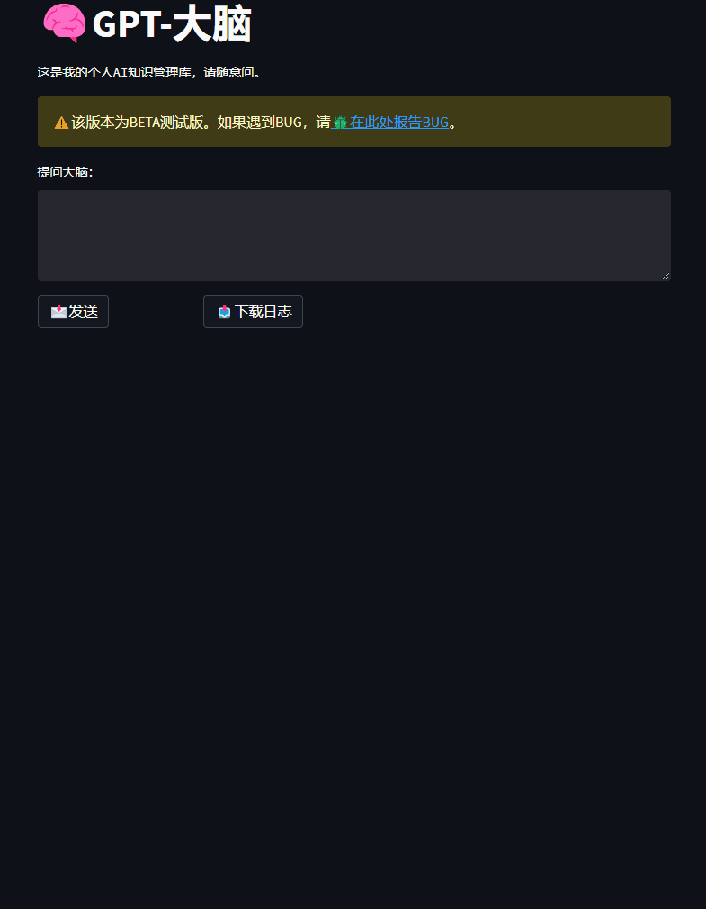
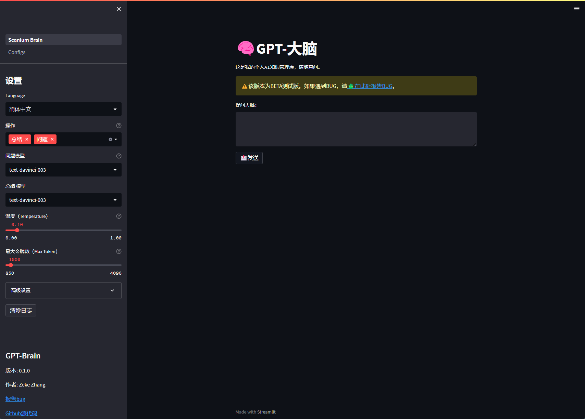
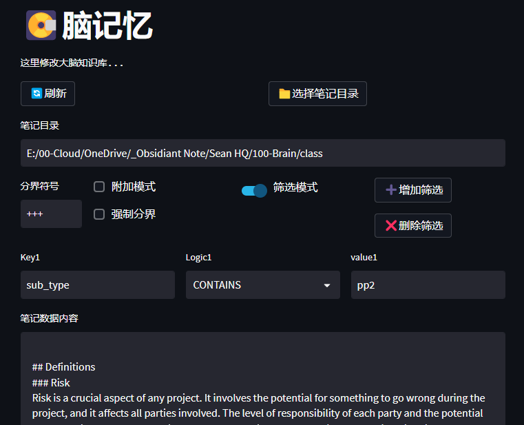

# 🧠 GPT 大脑

>**[中文说明](./README_CN.md)** | **[日本語説明書](README_JP.md)** | **[English](../README.md)**

*⭐️ 喜欢这个仓库? 请给个星!*

*💡此项目由youtuber [All About AI](https://www.youtube.com/@AllAboutAI) 的视频 [Second Brain](https://www.youtube.com/watch?v=1k2JpJRIoAA&ab_channel=AllAboutAI)启发。请关注他的频道。*

*💡本人并非专业程序猿，并且是一个python小白，此项目可能会出现各种bug。如果你遇到bug，请在[问题栏](https://github.com/sean1832/GPT-Brain/issues)里提出，我会尽可能的进行修补。*

### 简介
本程序利用[GPT-3](https://platform.openai.com/docs/models/gpt-3)和[3.5](https://platform.openai.com/docs/models/gpt-3-5)的能力，提供对原子笔记内容的概括，以及针对笔记的特定内容的回答。
该程序扫描指定目录（通常是包含多个笔记的vault），并将所有笔记的内容附加到单个文件中。
该文件随后用作用户查询的上下文。程序能够识别笔记内容之间的关系，并生成一个精炼的回答，概括关键要点。

尽管该程序与使用markdown或txt的其他笔记软件兼容，但它主要是针对[Obsidian](https://obsidian.md/)设计的。

### 功能
- [x] 使用 [OpenAI GPT-3](https://platform.openai.com/docs/models/gpt-3)和 [GPT-3.5 (ChatGPT)](https://platform.openai.com/docs/models/gpt-3-5) 生成回答。
- [x] 使用 [OpenAI embedding](https://platform.openai.com/docs/guides/embeddings/what-are-embeddings) 对笔记内容和问题进行对称比较，以增强搜索效果。
- [x] 可配置prompt。
- [x] 可个性化的个人背景信息以获得更贴切的答案。
- [x] 与 [Obsidian note](https://obsidian.md/) 目录相连，以便进行简单的笔记内容更新。
- [x] 笔记内容预览 & 直接修改。
- [x] 使用分隔符对笔记解析，以进行有选择性的文本写入。
- [x] [Obsidian YAML frontmatter](https://help.obsidian.md/Editing+and+formatting/Metadata) 过滤。
- [x] OpenAI API 密钥管理。
- [x] 提供4种语言模型选择以适应不同需求。
- [x] 基本和高级参数滑块，以便于调整OpenAI语言模型配置。

### 未来计划
- [ ] 支持PDF笔记格式。
- [ ] 支持PDF OCR扫描。
- [ ] 支持Word文档格式。

## 安装
### 1. 所需条件

- 安装 **[python 3.11](https://www.python.org/downloads)** | [python 安装教程(Bilibili)](https://www.bilibili.com/video/BV1f3411t73m/?spm_id_from=333.337.search-card.all.click&vd_source=f96c4c534fe9f3ff6591942502d9d3a7)
- OpenAI **[API 密钥](https://platform.openai.com/account/api-keys)**（需要注册OpenAI账号）
- (可选) 安装 **[GitHub Desktop](https://desktop.github.com/)** 或者 **[Git](https://git-scm.com/downloads)** | [GitHub Desktop 安装教程(Bilibili)](https://www.bilibili.com/video/BV1Ns411M7dq/?spm_id_from=333.337.search-card.all.click&vd_source=f96c4c534fe9f3ff6591942502d9d3a7)
- (可选) 安装 **[Obsidian (黑曜石笔记)](https://obsidian.md/)**

### 2. 首次设置
1. 下载本仓库
1. 运行 `SETUP.bat`
2. 输入您的 OpenAI API 密钥

### 3. 运行
- 运行 `RUN.bat`

## demo

### 主页

### 大脑记忆（笔记内容）
