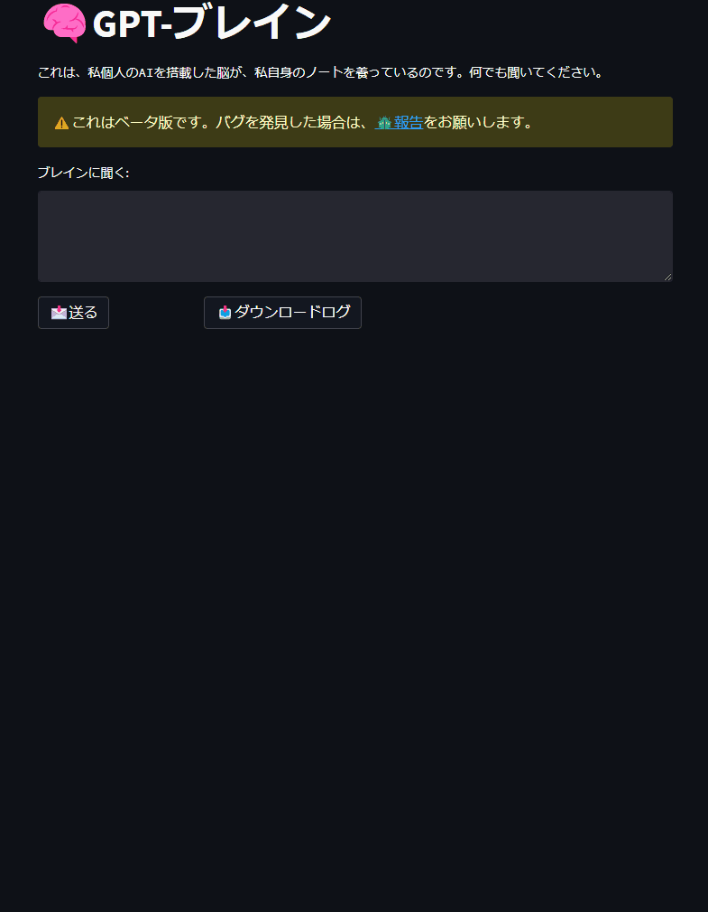
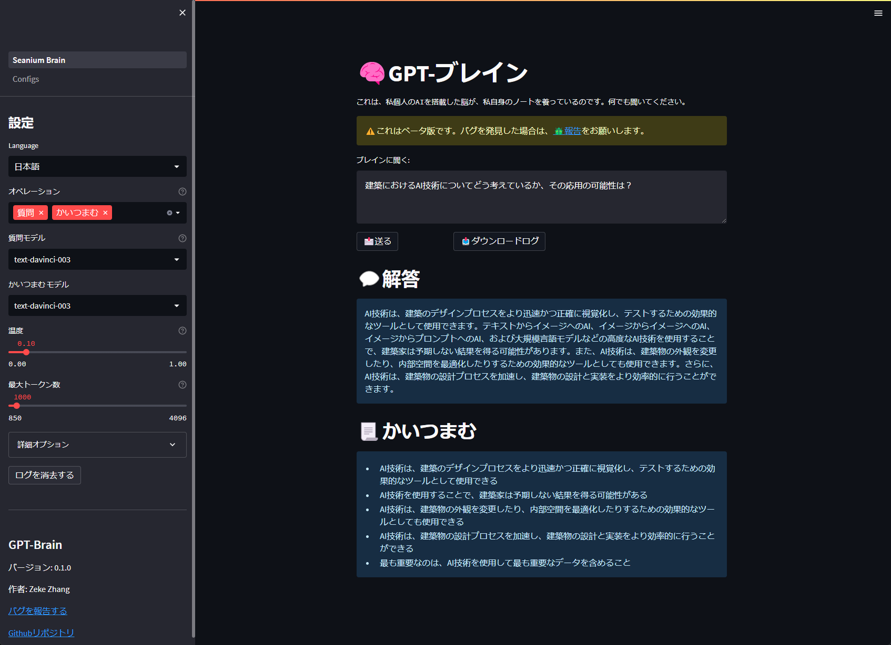

# 🧠 GPT ブレイン

>**[中文说明](./README_CN.md)** | **[日本語説明書](README_JP.md)** | **[English](../README.md)**

*⭐️ このレポが気に入ったら、ぜひ星を付けてください！*

*💡このプロジェクトは、youtuberの[All About AI](https://www.youtube.com/@AllAboutAI)の[セカンドブレイン](https://www.youtube.com/watch?v=1k2JpJRIoAA&ab_channel=AllAboutAI)の動画にインスパイアされています。ぜひ応援をご検討ください！*。

*💡私はプロのプログラマーではなく、Pythonにもかなり慣れていないため、このプロジェクトにはバグが含まれているかもしれません。もし何か問題があれば、[Issues section](https://github.com/sean1832/GPT-Brain/issues)で提案してください。*

### 紹介
このプログラムは、[GPT-3](https://platform.openai.com/docs/models/gpt-3)と[3.5](https://platform.openai.com/docs/models/gpt-3-5)の力を活用して、原子的なノートの内容の要約と、
特定のノートに関連する質問に回答することを提供します。
プログラムは、通常、複数のノートを含むvaultとして指定されたディレクトリをスキャンし、
すべてのノートの内容を単一のファイルに追加します。
このファイルは、ユーザーのクエリの文脈として機能します。プログラムは、ノートの内容の関係を識別し、
主要なポイントを要約する洗練された応答を生成できます。

このプログラムは、markdownまたはtxtを使用する他のノート取りソフトウェアでも互換性がありますが、
主に[Obsidian](https://obsidian.md/)を想定して設計されています。

### フィーチャー
- [x] [OpenAI GPT-3](https://platform.openai.com/docs/models/gpt-3)と[GPT-3.5 (ChatGPT)](https://platform.openai.com/docs/models/gpt-3-5)を使って、レスポンスを生成します。
- [x] [OpenAIエンベッディング](https://platform.openai.com/docs/guides/embeddings/what-are-embeddings)を使用して、質問とノートの内容を意味的に比較し、検索を強化します。
- [x] 設定可能なプロンプト。
- [x] より正確な回答を得るために、個人の背景情報をカスタマイズすることができます。
- [x] [Obsidian note](https://obsidian.md/)のローカルディレクトリと統合し、ノートの内容を簡単に更新できるようになりましす。
- [x] ノーツコンテンツのプレビューとリアルタイムでのコンテンツ修正。
- [x] 区切り文字を使ったセクションの解析で、ターゲットを絞ったアップデートを実現。
- [x] [Obsidian YAML frontmatter](https://help.obsidian.md/Editing+and+formatting/Metadata) フィルタリング。
- [x] OpenAI APIのキー管理。
- [x] ニーズに応じた言語モデルの選択。
- [x] OpenAI言語モデルの構成に対する基本的および高度なパラメータースライダー。。

### Todo
- [ ] PDFサポート。
- [ ] PDF OCRスキャンをサポート。
- [ ] Word文書をサポート。

## 設置
### 1. 必要なもの
- **[python 3.11](https://www.python.org/downloads)** をインストール | [Pythonインストール方法解説 (YouTube)](https://youtu.be/HBxCHonP6Ro?t=105)
- OpenAI **[APIキー](https://platform.openai.com/account/api-keys)** の確保
- (オプショナル) **[GitHub Desktop](https://desktop.github.com/)** または **[Git](https://git-scm.com/downloads)** をインストール
- (オプショナル) **[Obsidian](https://obsidian.md/)** をインストール

### 2. 初めてのセットアップする
1. このレポジトリをダウンロードする。
2. `SETUP.bat`を起動する。
3. OpenAI API キーを入力る。

### 3. プロジェクトを起動する
- `RUN.bat`を起動する。

## デモ

### メインページ

### 脳内記憶

