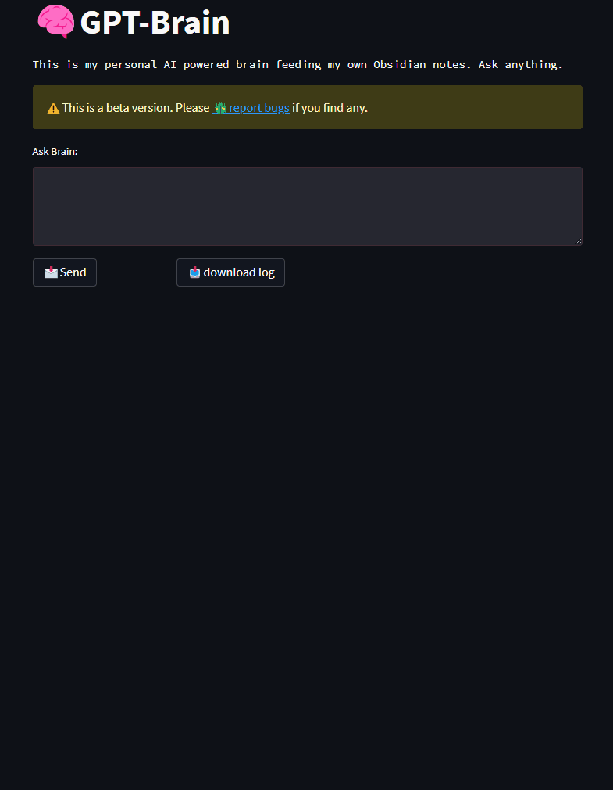
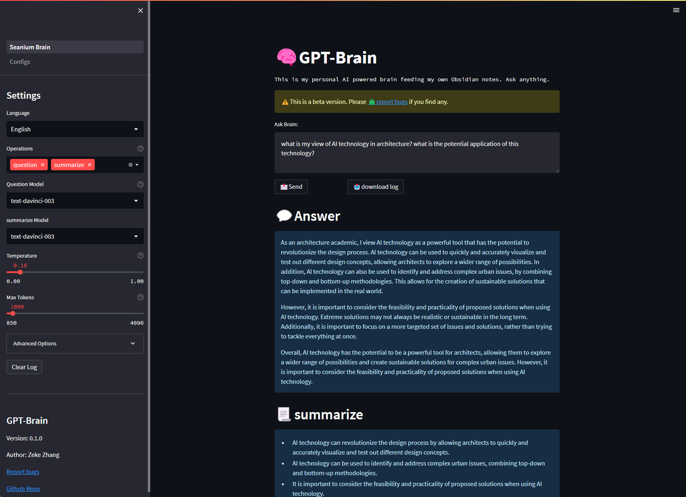
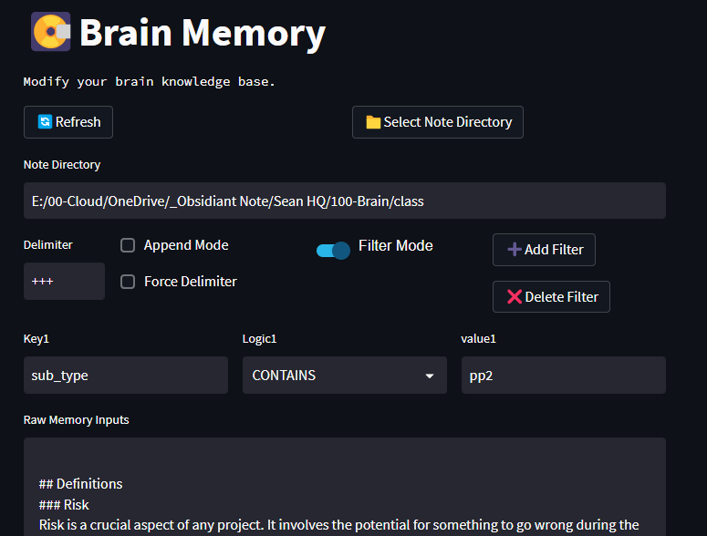

# 🧠 GPT Brain

> **[中文说明](./Documentation/README_CN.md)** | **[日本語説明書](./Documentation/README_JP.md)** | **[English](./README.md)**

*⭐️ Like this repo? please consider a star!*

*💡This project is inspired by youtuber [All About AI](https://www.youtube.com/@AllAboutAI)'s video on [Second Brain](https://www.youtube.com/watch?v=1k2JpJRIoAA&ab_channel=AllAboutAI). Please consider support him!*

*💡As I am not a professional programmer and am fairly new to Python, this project may contain bugs. If you encounter any issues, please suggest them in the [Issues section](https://github.com/sean1832/GPT-Brain/issues).*

### Description
This program leverages the power of [GPT-3](https://platform.openai.com/docs/models/gpt-3) & [3.5](https://platform.openai.com/docs/models/gpt-3-5) to provide a summary of the content of atomic notes, 
as well as answer questions related specifically to your notes. 
The program scans a designated directory, 
which is typically a vault containing multiple notes, 
and appends the contents of all the notes to a single file. 
This file then serves as the context for the user's query. 
The program is able to identify
relationships between the contents of the notes, 
and generate a refined response that summarizes the key points.

Although the program is compatible with other note-taking software that uses
markdown or txt, 
it is primarily designed with [Obsidian](https://obsidian.md/) in mind. 

### Feature
- [x] Use [OpenAI GPT-3](https://platform.openai.com/docs/models/gpt-3) and [GPT-3.5 (ChatGPT)](https://platform.openai.com/docs/models/gpt-3-5) to generate response.
- [x] Use [OpenAI embedding](https://platform.openai.com/docs/guides/embeddings/what-are-embeddings) for semetic comparison of question and note content for enhanced searching.
- [x] Configurable prompts.
- [x] Customizable personal background information for more accurate answers.
- [x] Integration with [Obsidian note](https://obsidian.md/) local directory for easy note content updates.
- [x] Note content preview & content modification.
- [x] Section parsing using delimiters for targeted updates.
- [x] [Obsidian YAML frontmatter](https://help.obsidian.md/Editing+and+formatting/Metadata) filtering.
- [x] OpenAI API key management.
- [x] OpenAI Language model selection for different needs.
- [x] Basic & Advanced parameter sliders for OpenAI Language model configurations.

### Todo
- [ ] Support PDF format。
- [ ] Support PDF OCR scan。
- [ ] Support Word document。

## Install
### 1. What you need
- Install **[python 3.11](https://www.python.org/downloads)** | [python installation tutorial (YouTube)](https://youtu.be/HBxCHonP6Ro?t=105)
- OpenAI **[API keys](https://platform.openai.com/account/api-keys)**
- **[GitHub Desktop](https://desktop.github.com/)** or **[Git](https://git-scm.com/downloads)** (optional)
- **[Obsidian](https://obsidian.md/)** (optional)

### 2. Set up the project for the first time
1. Download the project
2. Run `SETUP.bat`
3. Enter your OpenAI API Key

### 3. Run
- Execute `RUN.bat`

## Demo

### Main Page

### Brain Memory

